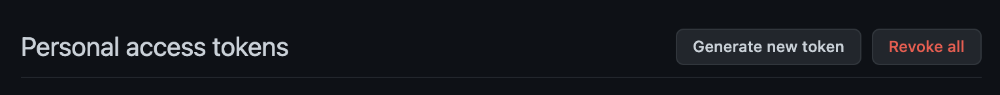
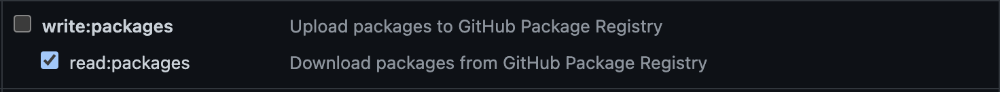

# Magna-React

## Introduction

Magna-React is a React library that implements UI components according to the [Atomic design specification](http://ux-document-lnx/~designer/sbg-ux/components/atoms/getting-started.html) (requires VPN) with some Magnetic re-skinning [Magnetic Design - Figma](https://www.figma.com/file/oVZWatImEIbl1c8sjdGxi0/%F0%9F%A7%B2--Magnetic-Design-Library) Developers can enjoy the following features:

- Flexible, tree-shakable components
- Full [documentation](https://magna-react.vercel.app/) -- WIP
- Baked-in accessibility
- Responsive helpers
- CSS helpers
- Form validation
- Extensibility

---

## Usage

Magna-React is provided as an npm package from GitHub packages. To configure for use:

### Generate an access token

1. Go to https://github.com/settings/tokens
2. Click `Generate new token`



3. Enter a note to identify the token
4. Select the `read:packages` scope



5. Click `Generate`
6. Copy the token

7. Add the repository to your `~/.npmrc` file:

```
@advthreat:registry=https://npm.pkg.github.com
```

9. Paste the following in to your `~/.npmrc` file, replacing TOKEN with your new token:

```
//npm.pkg.github.com/:_authToken=TOKEN
```

### Installation

1. Run

```
npm install @cisco-sbg-ui/magna-react
```

2. Remove `@cisco-sbg-ui/atomic-react` from package.json

3. Swap imports/babel config from atomic-react to magna-react

---

## Component Development

Feel free to reach out to Robert Harris (roberha2) via Webex Teams to discuss contributions.

## DEV ===============

### Run Locally

```
npm ci
npm run dev
```

#### Integration testing

```
npm run build
npm pack
```

Install magna as a dependency in other application:

- In the other application's `package.json`, point to the generated tar file and `npm i`

---
